<div align="center">

# 💸 STUDENT EXPENSE TRACKER 💸

### ✦ SMART MONEY MANAGEMENT • BUDGET INTELLIGENCE • FINANCIAL ANALYTICS ✦


<br/>


<br/>


<br/>

### 💵 💴 💶 💷 💸 💰 📊 📈 💱

> ## RECORD • CONTROL • ANALYZE • CONVERT
>
> **A modern Android financial-management application designed for smarter student spending.**

<br/>

[💸 Expenses](#-expense-engine) •
[💰 Budgets](#-budget-engine) •
[📊 Charts](#-financial-visualization-center) •
[🧠 Architecture](#-system-architecture) •
[💱 Currency](#-currency-conversion-engine) •
[🛠 Stack](#-technology-universe) •
[⚙️ Setup](#️-installation--setup) •
[🐍 Snake](#-kinetic-contribution-snake) •
[👨‍💻 Developer](#-developer)

</div>

---

<div align="center">

# 💎 FINANCIAL COMMAND CENTER


</div>

```text
╔══════════════════════════════════════════════════════════════════════╗
║                                                                      ║
║                    💸 STUDENT EXPENSE TRACKER                        ║
║                                                                      ║
║   ┌────────────┐   ┌────────────┐   ┌────────────┐   ┌───────────┐   ║
║   │ 💸 EXPENSE │──▶│ 💰 BUDGET │──▶│ 📊 ANALYZE │──▶│ 💱 CONVERT│   ║
║   └────────────┘   └────────────┘   └────────────┘   └───────────┘   ║
║                                                                      ║
║       RECORD           CONTROL          UNDERSTAND        CONVERT     ║
║                                                                      ║
║                     YOUR MONEY • YOUR CONTROL                        ║
║                                                                      ║
╚══════════════════════════════════════════════════════════════════════╝
```

Student Expense Tracker combines **expense recording**, **budget management**, **financial visualization**, and **currency conversion** inside one Android application.

> **Financial data becomes valuable when it can be recorded clearly, visualized meaningfully, and understood instantly.**

---

<div align="center">

# 💵 MONEY FLOW


</div>

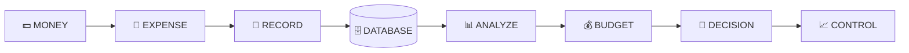

---

# ⚡ CORE FEATURE UNIVERSE

<table>
<tr>

<td width="50%" valign="top">

## 💸 Expense Engine

**Capture everyday spending.**

- Add new expenses
- Record transaction titles
- Enter monetary values
- Categorize transactions
- Select transaction dates
- Add optional notes
- Display expense history
- RecyclerView-based lists
- SQLite persistence

</td>

<td width="50%" valign="top">

## 💰 Budget Engine

**Control spending before it becomes a problem.**

- Create category budgets
- Calculate spending totals
- Calculate remaining balance
- Measure budget consumption
- Percentage indicators
- Visual progress tracking
- Warning thresholds
- Category-based monitoring

</td>

</tr>

<tr>

<td width="50%" valign="top">

## 📊 Analytics Engine

**Transform transactions into visual information.**

- Pie-chart analytics
- Bar-chart analytics
- Category comparisons
- Weekly analysis
- Monthly analysis
- All-time analysis
- Spending summaries
- MPAndroidChart integration

</td>

<td width="50%" valign="top">

## 💱 Currency Engine

**Convert financial values internationally.**

- LKR-based input
- International currencies
- Exchange-rate retrieval
- Country information
- Currency names
- Currency codes
- Retrofit networking
- JSON processing with Gson

</td>

</tr>
</table>

---

<div align="center">

# 🎨 FINANCIAL ENGINE STATUS


</div>

---

# 📊 FINANCIAL VISUALIZATION CENTER

<div align="center">


</div>

## 🥧 Spending Distribution — Pie Chart

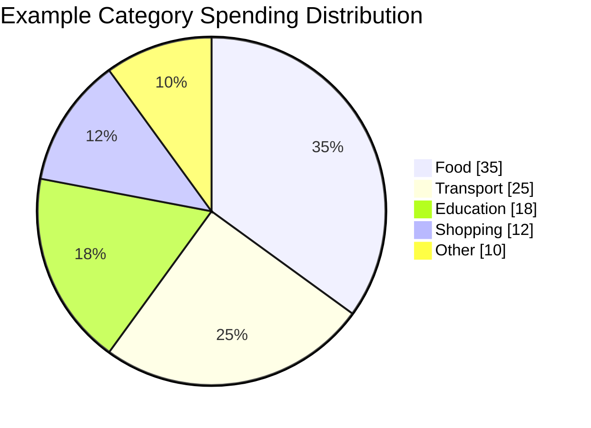

> The values above demonstrate the type of category distribution supported by the analytics module. They are illustrative rather than actual user financial records.

---

## 📊 Category Spending — Bar Chart

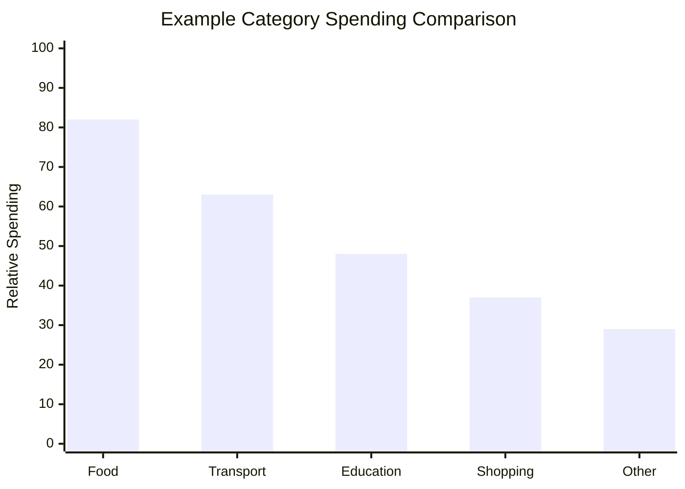

---

## 📈 Weekly Spending — Line Chart

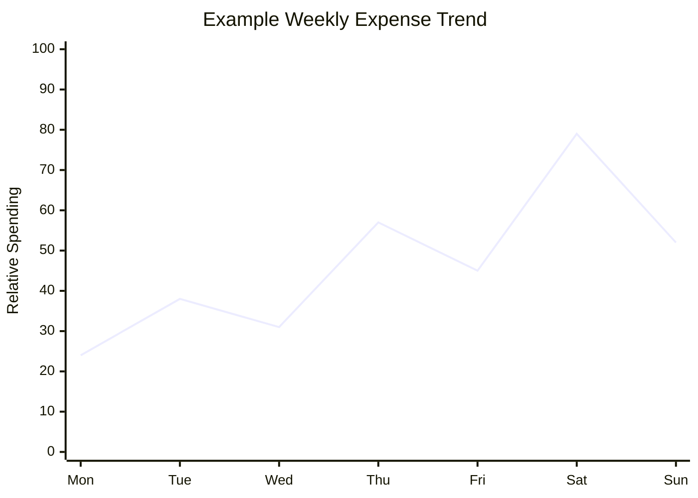

---

## 💰 Budget vs Spending

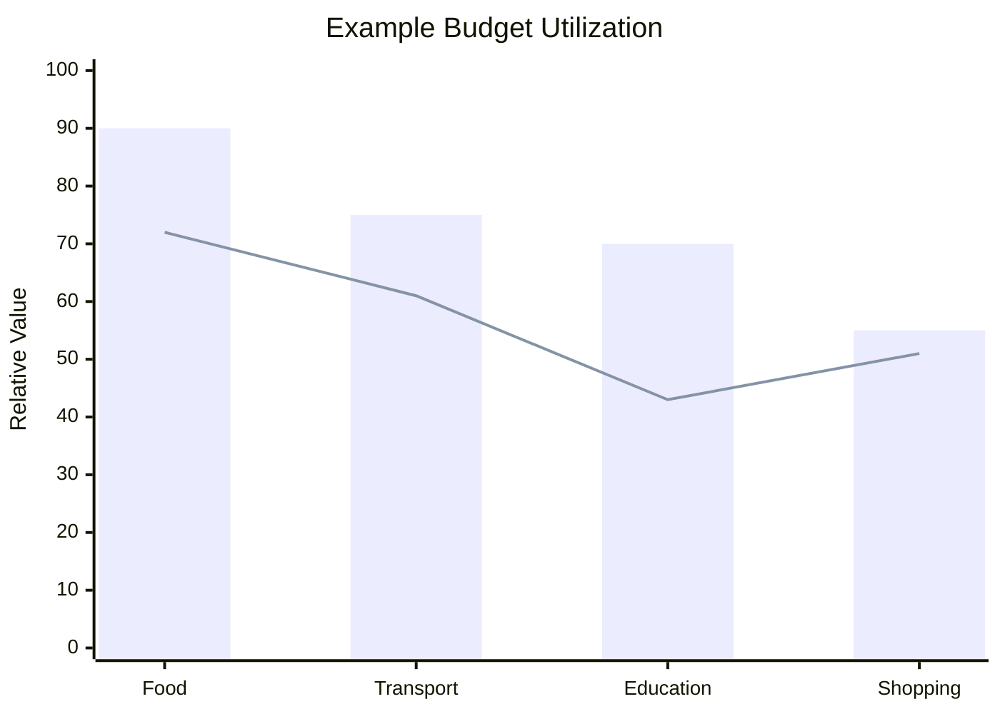

---

# 🎯 BUDGET INTELLIGENCE

<div align="center">


</div>

```text
0%                                                               100%
│                                                                   │
▼                                                                   ▼

🟢 SAFE                      🟠 CAUTION                       🔴 WARNING
████████░░░░░░░░░░░░         ███████████████░░░░░           ████████████████████

< 60%                         60% – 79%                       ≥ 80%

   │                               │                              │
   ▼                               ▼                              ▼
ON TRACK                       WATCH SPENDING                 TAKE ACTION
```

| Budget Usage | Status | Meaning |
|:---:|:---:|:---|
| **Below 60%** | 🟢 SAFE | Spending remains comfortably within budget |
| **60–79%** | 🟠 CAUTION | Spending is approaching the category limit |
| **80%+** | 🔴 WARNING | Budget is close to or beyond its limit |

---

# 💹 FINANCIAL DECISION PIPELINE

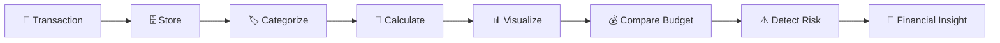

---

# 🧠 SYSTEM ARCHITECTURE

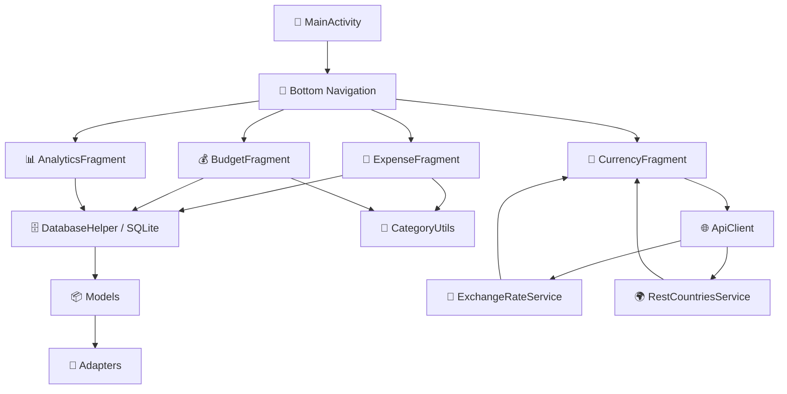

---

# 🧬 APPLICATION DATA FLOW

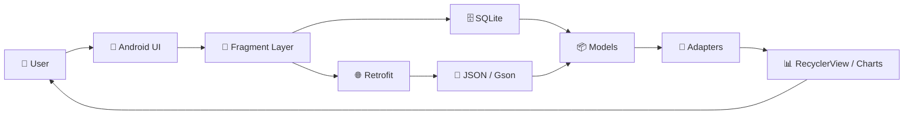

---

# 🧭 APPLICATION NAVIGATION

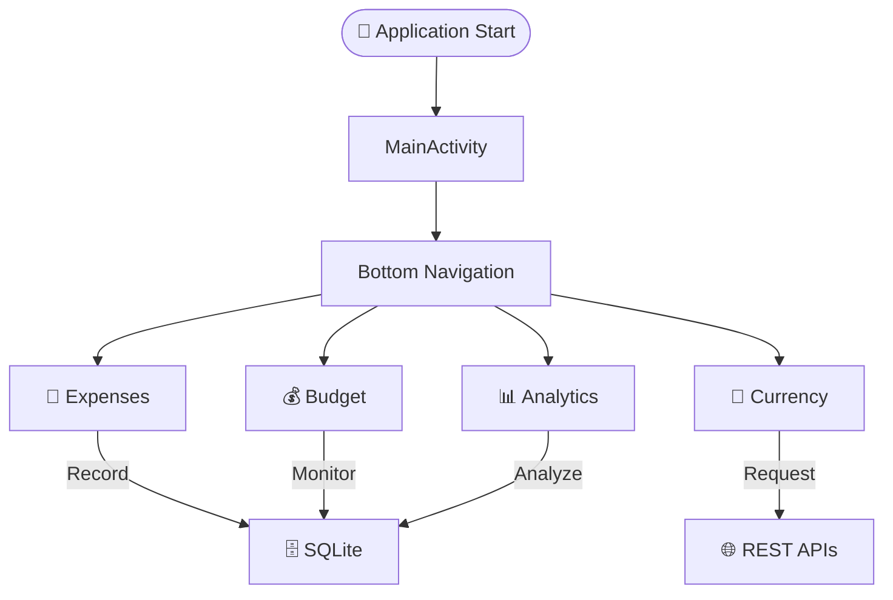

---

# 🗄️ DATA MODEL MAP

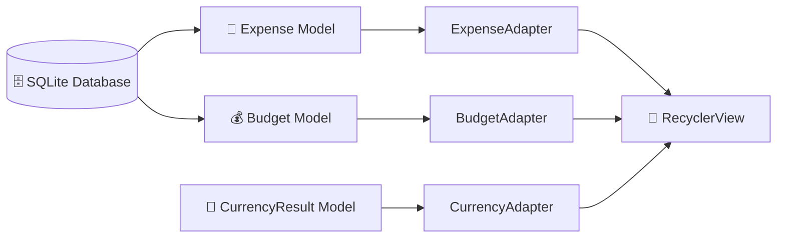

---

# 💱 CURRENCY CONVERSION ENGINE

<div align="center">


### 💵 USD • 💶 EUR • 💷 GBP • 💴 JPY • ₹ INR • 🌍 MORE

</div>

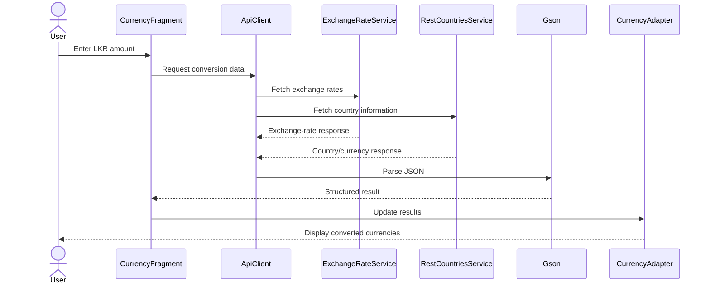

---

# 🌍 GLOBAL MONEY PIPELINE

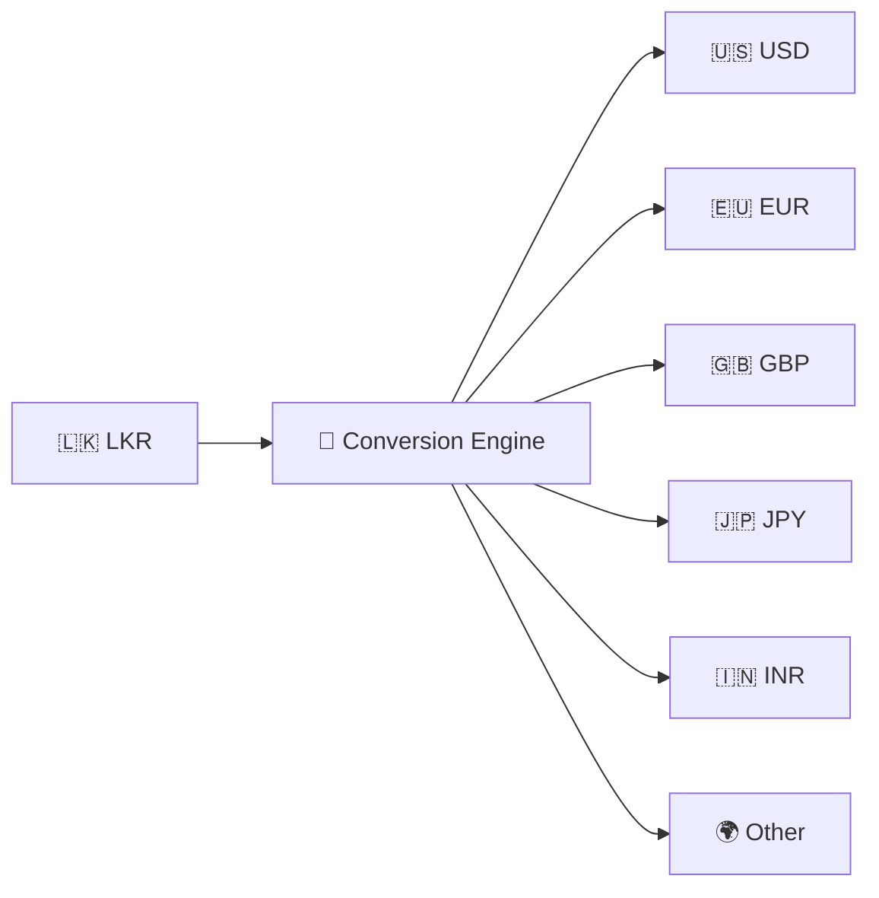

---

# 🛠 TECHNOLOGY UNIVERSE

<div align="center">


### ☕ CORE DEVELOPMENT


### 🎨 INTERFACE


### 🗄️ DATA & NETWORKING


### 📊 VISUALIZATION


</div>

---

# ⚙️ TECHNOLOGY RESPONSIBILITIES

| Technology | Purpose |
|---|---|
| ☕ **Java** | Core Android application logic |
| 📱 **Android SDK** | Mobile application platform |
| 🎨 **XML** | Interface layouts and resources |
| 🧩 **AndroidX** | Android application components |
| ✨ **Material Components** | Modern interface elements |
| 📜 **RecyclerView** | Dynamic financial lists |
| 🗄️ **SQLite** | Local financial-data persistence |
| 🌐 **Retrofit** | REST API communication |
| 🔌 **OkHttp** | HTTP networking |
| 🧾 **Gson** | JSON parsing |
| 📊 **MPAndroidChart** | Pie and bar financial visualization |
| ⚙️ **Gradle** | Build and dependency management |

---

# 📁 PROJECT STRUCTURE

```text
StudentExpenseTracker/
│
├── 📱 app/
│   ├── build.gradle
│   ├── proguard-rules.pro
│   │
│   └── src/main/
│       │
│       ├── AndroidManifest.xml
│       │
│       ├── ☕ java/com/studentexpensetracker/
│       │   │
│       │   ├── MainActivity.java
│       │   │
│       │   ├── adapters/
│       │   │   ├── BudgetAdapter.java
│       │   │   ├── CurrencyAdapter.java
│       │   │   └── ExpenseAdapter.java
│       │   │
│       │   ├── api/
│       │   │   ├── ApiClient.java
│       │   │   ├── ExchangeRateService.java
│       │   │   └── RestCountriesService.java
│       │   │
│       │   ├── database/
│       │   │   └── DatabaseHelper.java
│       │   │
│       │   ├── fragments/
│       │   │   ├── AnalyticsFragment.java
│       │   │   ├── BudgetFragment.java
│       │   │   ├── CurrencyFragment.java
│       │   │   └── ExpenseFragment.java
│       │   │
│       │   ├── models/
│       │   │   ├── Budget.java
│       │   │   ├── CurrencyResult.java
│       │   │   └── Expense.java
│       │   │
│       │   └── utils/
│       │       └── CategoryUtils.java
│       │
│       └── 🎨 res/
│           ├── color/
│           ├── drawable/
│           ├── layout/
│           ├── menu/
│           ├── mipmap-*/
│           └── values/
│
├── ⚙️ gradle/
│   └── wrapper/
│
├── .gitignore
├── build.gradle
├── gradle.properties
├── gradlew
├── gradlew.bat
└── settings.gradle
```

---

# 🗺️ DEVELOPMENT TIMELINE

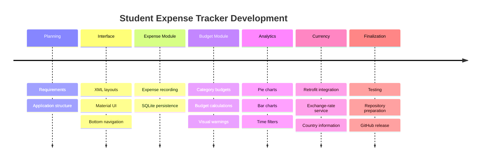

---

# 🖥️ FINANCIAL SYSTEM TERMINAL

<div align="center">


</div>

```text
╔══════════════════════════════════════════════════════════════════════╗
║ AHAMED@STUDENT-EXPENSE-TRACKER:~$ financial-system --status         ║
╠══════════════════════════════════════════════════════════════════════╣
║                                                                      ║
║ 💸 Expense Engine       ████████████████████      ONLINE             ║
║ 💰 Budget Engine        ████████████████████      ONLINE             ║
║ 📊 Analytics Engine     ████████████████████      ONLINE             ║
║ 💱 Currency Engine      ████████████████████      ONLINE             ║
║ 🗄️ SQLite Storage       ████████████████████      ONLINE             ║
║ 🌐 Retrofit Network     ████████████████████      ONLINE             ║
║                                                                      ║
║ FINANCIAL SYSTEM STATUS                       ● OPERATIONAL           ║
║                                                                      ║
╚══════════════════════════════════════════════════════════════════════╝
```

---

# 🎮 MONEY QUEST

<div align="center">


</div>

```text
╔══════════════════════════════════════════════════════════════════════╗
║                        💰 MONEY QUEST                               ║
╠══════════════════════════════════════════════════════════════════════╣
║                                                                      ║
║ PLAYER       STUDENT                                                 ║
║ MISSION      MASTER PERSONAL FINANCE                                 ║
║                                                                      ║
║ QUEST 01     💸 Record Expenses                           [✓]         ║
║ QUEST 02     💰 Control Budgets                            [✓]         ║
║ QUEST 03     🥧 Unlock Pie Analytics                      [✓]         ║
║ QUEST 04     📊 Unlock Bar Analytics                      [✓]         ║
║ QUEST 05     📈 Understand Spending Trends                [✓]         ║
║ QUEST 06     💱 Activate Currency Engine                  [✓]         ║
║                                                                      ║
║                  ★ ACHIEVEMENT UNLOCKED ★                            ║
║                                                                      ║
║                    💎 SMART MONEY MANAGER 💎                         ║
║                                                                      ║
╚══════════════════════════════════════════════════════════════════════╝
```

---

# 🔄 DEVELOPMENT LOOP

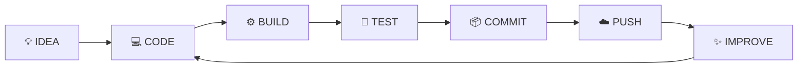

---

# 🔮 FUTURE EVOLUTION

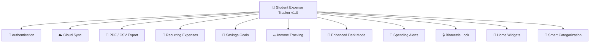

---

# ⚙️ INSTALLATION & SETUP

## 1️⃣ Clone the Repository

```bash
git clone https://github.com/Ahamed369/Student-Expense-Tracker.git
```

## 2️⃣ Enter the Project

```bash
cd Student-Expense-Tracker
```

## 3️⃣ Open Android Studio

```text
Android Studio
      │
      ▼
    File
      │
      ▼
     Open
      │
      ▼
Student-Expense-Tracker
```

## 4️⃣ Gradle Synchronization

Allow Android Studio to synchronize the project and download the required dependencies.

## 5️⃣ Choose a Device

```text
Android Emulator
       │
      OR
       │
Physical Android Device
```

## 6️⃣ Run the Application

```text
▶ Run 'app'
```

---

# 🔨 BUILD FROM TERMINAL

### Windows

```powershell
.\gradlew.bat assembleDebug
```

### Linux / macOS

```bash
./gradlew assembleDebug
```

---

# 📦 CORE DEPENDENCIES

```gradle
implementation 'androidx.appcompat:appcompat:1.6.1'
implementation 'com.google.android.material:material:1.11.0'
implementation 'androidx.constraintlayout:constraintlayout:2.1.4'
implementation 'androidx.recyclerview:recyclerview:1.3.2'
implementation 'androidx.cardview:cardview:1.0.0'
implementation 'androidx.fragment:fragment:1.6.2'
implementation 'androidx.core:core:1.12.0'

implementation 'com.github.PhilJay:MPAndroidChart:v3.1.0'

implementation 'com.squareup.retrofit2:retrofit:2.9.0'
implementation 'com.squareup.retrofit2:converter-gson:2.9.0'

implementation 'com.squareup.okhttp3:logging-interceptor:4.12.0'

implementation 'com.google.code.gson:gson:2.10.1'
```

---

# 🔐 REPOSITORY HYGIENE

```text
.idea/
.gradle/

build/
**/build/

local.properties

*.apk
*.aab

*.jks
*.keystore

.vscode/

*.log
*.tmp
*.temp
```

---

# 🐍 KINETIC CONTRIBUTION SNAKE

<div align="center">

### 💸 THE MONEY SNAKE IS HUNGRY FOR COMMITS 💸

<picture>
  <source media="(prefers-color-scheme: dark)" srcset="https://raw.githubusercontent.com/Ahamed369/Student-Expense-Tracker/output/github-contribution-grid-snake-dark.svg">
  <source media="(prefers-color-scheme: light)" srcset="https://raw.githubusercontent.com/Ahamed369/Student-Expense-Tracker/output/github-contribution-grid-snake.svg">
  
</picture>

<br/>


</div>

> The snake becomes visible after the GitHub Actions workflow successfully generates the `output` branch.

---

# 📡 LIVE REPOSITORY PULSE

<div align="center">


</div>

---

# 💎 PROJECT VALUE MATRIX

<div align="center">

| 💸 Finance | 📊 Data | 📱 Mobile | 🌐 Network |
|:---:|:---:|:---:|:---:|
| Expense Tracking | Analytics | Android UI | REST APIs |
| Budget Control | Pie Charts | Material Design | Retrofit |
| Currency Conversion | Bar Charts | RecyclerView | JSON |
| Spending Insight | Trends | Fragments | OkHttp |

</div>

---

# 🤝 CONTRIBUTING

```bash
git checkout -b feature/your-feature

git add .

git commit -m "Add your feature"

git push origin feature/your-feature
```

Then create a Pull Request.

---

# 👨‍💻 DEVELOPER

<div align="center">


## MR.AHAMED

### Computer Science Undergraduate
### Full-Stack & Mobile Application Developer
### Entrepreneur

<br/>

[](https://github.com/Ahamed369)

[](https://www.linkedin.com/in/mr-ahamed-6146a5276)

<br/>


<br/>

> **Building practical digital products through software engineering, mobile technology, design thinking, and entrepreneurship.**

</div>

---

# 📌 PROJECT INFORMATION

```text
╔════════════════════════════════════════════════════════════════╗
║                     PROJECT INFORMATION                        ║
╠════════════════════════════════════════════════════════════════╣
║                                                                ║
║ Project      : Student Expense Tracker                         ║
║ Repository   : Student-Expense-Tracker                         ║
║ Owner        : Ahamed369                                       ║
║ Developer    : Mr.Ahamed                                       ║
║                                                                ║
║ Platform     : Android                                         ║
║ Language     : Java                                            ║
║ Interface    : XML + Material Components                       ║
║ Database     : SQLite                                          ║
║ Networking   : Retrofit + OkHttp                               ║
║ JSON         : Gson                                            ║
║ Charts       : MPAndroidChart                                  ║
║                                                                ║
║ Version      : 1.0                                             ║
║ Branch       : main                                            ║
║ Min SDK      : 24                                              ║
║ Target SDK   : 34                                              ║
║                                                                ║
╚════════════════════════════════════════════════════════════════╝
```

---

<div align="center">

# 💰 MONEY • DATA • CONTROL


<br/>

# ⭐ SUPPORT THE PROJECT


<br/><br/>

### 💵 💴 💶 💷 💸 💰 💳 📊 📈 💱

# STUDENT EXPENSE TRACKER

### TRACK SMARTER • BUDGET BETTER • UNDERSTAND MORE


<br/><br/>


<br/>

**Designed & Developed by Mr.Ahamed**

**© 2026 Mr.Ahamed**

</div>
